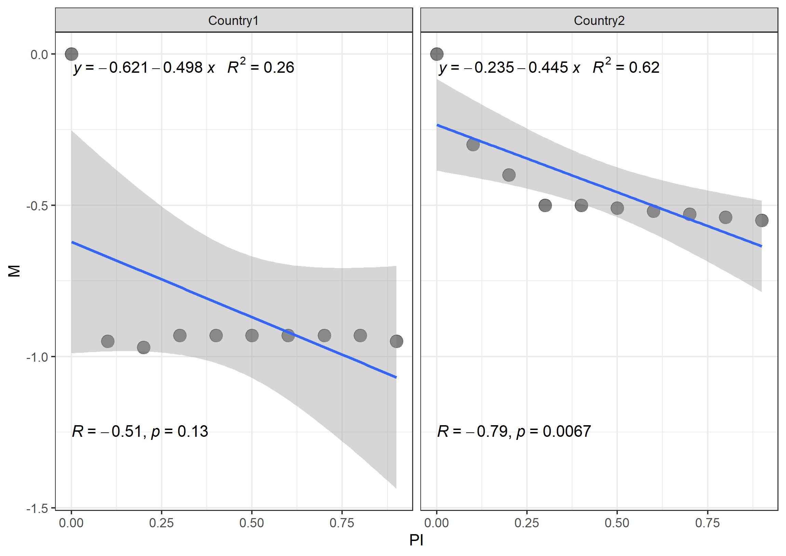

```{r setup, include=FALSE}
knitr::opts_chunk$set(echo = TRUE)

rm(list = ls())
library("knitr")
library("dLagM")
library("tidyverse")

options(scipen=1, digits=2)


set.seed(12345)
```

# Mock Series

Let's generate a few archetypical movement and policy series.

* Gradual moderate: It takes a few days for the population to react to government's stringency, but they are fairly compliant after all. 
* Immediate moderate: Population reacts on the same day to stringency, and will maintain behaviour for as long as policy is in place.
* Day after moderate: Population reacts the day after policy is in place, and from then on maintains behaviour for as long as policy is in place.
* Immediate reverse: Population reacts immediately to policy, but takes up some more activity in the following days.
* Immediate weak: people reduce movement immediately, but to a lesser degree than above.
* None: There is no relationship between stringency and movement, but movement follows a random walk.

The data generating process is ARDL(3,3), and I set the policy variable exogenousely and set the parameters as follows (parameters listed from left to right as listed above):


```{r series1, echo=FALSE, warning=FALSE}
mutate_cond <- function(.data, condition, ..., envir = parent.frame()) {
  condition <- eval(substitute(condition), .data, envir)
  .data[condition, ] <- .data[condition, ] %>% mutate(...)
  .data
}

df <- read.csv("mock-series.csv")
colnames(df)[1] <- "Series"

nobs <- 60
burnin <- 10
noise.string <- 0.001
noise.mov <- 0.01

ardl.dgp <- expression(df.now$Stringency * vec.q[1] +
                         lag(df.now$Stringency, 1) * vec.q[2] +
                         lag(df.now$Stringency, 2) * vec.q[3] +
                         lag(df.now$Stringency, 3) * vec.q[4] +
                         lag(df.now$Movement, 1) * vec.p[1] +
                         lag(df.now$Movement, 2) * vec.p[2] +
                         lag(df.now$Movement, 3) * vec.p[3] + 
                         rnorm(1,0,0.01))

df.generic <- data.frame(Series = rep("name_series",nobs),
                  Day = 1:nobs,
                  Movement = rep(0,nobs),
                  Stringency = rep(0,nobs))

# Gradual Moderate series

vec.p <- c(0, 0, 0)
vec.q <- c(-0.35, -0.2, -0.15, -0.1)
pq.grad_mod <- cbind(c(NA,vec.p),vec.q)

df.now <- df.generic %>%
  mutate(Series = "gradual_moderate") %>%
  mutate(Stringency = c(rep(0,burnin), 
                        rep(1,nobs-burnin)) + rnorm(nobs,0,noise.string))

for (obs in (burnin+1):nobs) {
  df.now$Movement[obs] <- eval(ardl.dgp)[obs] 
}
df.now$Movement <- df.now$Movement + rnorm(length(df.now$Movement),0,noise.mov)

df.grad_mod <- df.now

# Immediate moderate series

vec.p <- c(0, 0, 0)
vec.q <- c(-0.8, 0, 0, 0)
pq.immed_mod <- cbind(c(NA,vec.p),vec.q)

df.now <- df.generic %>%
  mutate(Series = "immediate_moderate") %>%
  mutate(Stringency = c(rep(0,burnin), 
                        rep(1,nobs-burnin)) + rnorm(nobs,0,noise.string))

for (obs in (burnin+1):nobs) {
  df.now$Movement[obs] <- eval(ardl.dgp)[obs] 
}
df.now$Movement <- df.now$Movement + rnorm(length(df.now$Movement),0,noise.mov)

df.immed_mod <- df.now

# Day after moderate series

vec.p <- c(0, 0, 0)
vec.q <- c(0, -0.8, 0, 0)
pq.day_mod <- cbind(c(NA,vec.p),vec.q)

df.now <- df.generic %>%
  mutate(Series = "dayafter_moderate") %>%
  mutate(Stringency = c(rep(0,burnin), 
                        rep(1,nobs-burnin)) + rnorm(nobs,0,noise.string))

for (obs in (burnin+1):nobs) {
  df.now$Movement[obs] <- eval(ardl.dgp)[obs] 
}
df.now$Movement <- df.now$Movement + rnorm(length(df.now$Movement),0,noise.mov)

df.day_mod <- df.now

# Immediate weak series

vec.p <- c(0, 0, 0)
vec.q <- c(-0.3, 0, 0, 0)
pq.immed_weak <- cbind(c(NA,vec.p),vec.q)

df.now <- df.generic %>%
  mutate(Series = "immediate_weak") %>%
  mutate(Stringency = c(rep(0,burnin), 
                        rep(1,nobs-burnin)) + rnorm(nobs,0,noise.string))

for (obs in (burnin+1):nobs) {
  df.now$Movement[obs] <- eval(ardl.dgp)[obs] 
}
df.now$Movement <- df.now$Movement + rnorm(length(df.now$Movement),0,noise.mov)

df.immed_weak <- df.now

# Immediate reverse series

vec.p <- c(-0.5, -0.4, -0.3)
vec.q <- c(-0.7, -0.1, -0.05, -0.01)
pq.immed_rev <- cbind(c(NA,vec.p),vec.q)

df.now <- df.generic %>%
  mutate(Series = "immediate_reverse") %>%
  mutate(Stringency = c(rep(0,burnin), 
                        rep(1,nobs-burnin)) + rnorm(nobs,0,noise.string))

for (obs in (burnin+1):nobs) {
  df.now$Movement[obs] <- eval(ardl.dgp)[obs] 
}
df.now$Movement <- df.now$Movement + rnorm(length(df.now$Movement),0,noise.mov) 

df.immed_rev <- df.now

# No relationship series

vec.p <- c(0, 0, 0)
vec.q <- c(0, 0, 0)
pq.none <- cbind(c(NA,vec.p),vec.q)

df.now <- df.generic %>%
  mutate(Series = "none") %>%
  mutate(Stringency = c(rep(0,burnin), 
                        rep(1,nobs-burnin)) + rnorm(nobs,0,noise.string))

for (obs in (burnin+1):nobs) {
  df.now$Movement[obs] <- (lag(df.now$Movement) + rnorm(1,0,0.05))[obs] 
}
df.now$Movement <- df.now$Movement + rnorm(length(df.now$Movement),0,noise.mov) 

df.none <- df.now


# Combine

df.all <- rbind(df.grad_mod,df.immed_mod,df.day_mod,df.immed_weak,df.immed_rev,df.none)

pq.all <- cbind(pq.grad_mod,pq.immed_mod,pq.day_mod,pq.immed_weak,pq.immed_rev,pq.none)
row.names(pq.all) <- c("t", "Lag 1", "Lag 2", "Lag 3")
colnames(pq.all) <- rep(c("AR(p)", "DL(q)"),length(unique(df.all$Series)))
pq.all

```


Let us focus on the first three series, which are almost identical except for how quickliy people respond to policy. In the 'long run', they'll all reduce movement by 0.8% for a 1% increase in stringency. An abrupt change in stringency from 0 to 100% would then look as follows:

```{r plot1, echo=FALSE, warning=FALSE}

df.plot <- df.all %>%
  pivot_longer(cols =  c("Stringency", "Movement"), names_to = "Variable") %>%
  arrange(Series, Variable, Day)
  

ggplot(df.plot, aes(Day,value, color = Variable)) +
  geom_line() +
  facet_wrap(~ Series) +
  ylim(-1.1,1.1) +
  theme_bw()
```

# Quantifying compliance (levels)

Let us compare our measures for this:

```{r compare measures, echo=FALSE, warning=FALSE}

# Compute correlations

correlations <- df.all %>%
  group_by(Series) %>%
  summarise(cor = cor(Stringency,Movement))

coefficients <- data.frame(Series = character(),coef = double(),
                   stringsAsFactors = FALSE)

# Compute coefficients

i <- 1
for (ser in unique(df.all$Series)) {
  coef.tmp <- lm(Movement ~ Stringency, data = df.all[which(df.all$Series == ser),])
  coefficients[i,2] <- coef.tmp$coefficients[2]
  coefficients[i,1] <- ser
  i <- i+1
}
rm(i)

# Compute ARDL 

i <- 1
ardl.results <- list()
lr.coefficient.ardl <- data.frame(Series = character(), 
                                  lr.coeff = double(),
                                  stringsAsFactors = FALSE)

for (ser in unique(df.all$Series)) {
  ardl.now <-ardlDlm(formula = Movement ~ Stringency, 
                     data = df.all[which(df.all$Series == ser),],
                     p = length(vec.p) , q = length(vec.q)-1)
  ardl.results[[ser]] <- ardl.now$model$coefficients
  lr.coefficient.ardl[i,2] <- sum(ardl.now$model$coefficients[c("Stringency.t",
                                                             paste0("Stringency.",1:length(vec.p)))]) /
    (1-sum(ardl.now$model$coefficients[paste0("Movement.",1:(length(vec.q)-1))]))
  
  lr.coefficient.ardl[i,1] <- ser
  
  i <- i+1
}
rm(i)

```

## Simple correlations:
```{r corr table, echo = FALSE}
correlations
```

* All series have a correlation of almost -1. This is irrespective of the actual intensity of the reaction: The correlation in 'immediate weak' (real elasticity -0.3) is the same as for immediate moderate (really 0.8), etc. Correlations are indifferent to the scale, which undermines our analysis.
* There is substantial correlation even for the 'none' case, which is entirely spurious. 


## Simple coefficients (=adding intercept):
```{r coeff table, echo = FALSE}
coefficients
```

* Much better: Coefficients are reflective of the actual strength of the relationship (compliance). All 'moderate' cases have a coefficient of ca. 0.8, the weak one of 0.3, the one where there is a reversal in behaviour is ca. 0.4 which is roughly where it settles.
* The 'none' case, again, spuriously indicates a substantial correlation.

## Long-run coefficients obtained from ARDL coefficients:

```{r ardl coeff table, echo = FALSE}
lr.coefficient.ardl

```

* All as with the coefficients above: Most relationships are correcly picked up and in relation to the real coefficients
* The coefficient for LR, however, goes through the roof: The spurious correlation issue is exacerbated.

## Summary (levels)

* Correlations are of little use if we are interested in the magnitude of movement reduction following policy change
* All measures will fall for the spurious relation introduced once the series follow a random walk (have a unit root).
* This is why we need to take first differences.

# Quantifying compliance (first difference)

```{r first diff, echo=FALSE}
df.all.diff <- df.all %>%
  group_by(Series) %>%
  mutate(Movement = c(NA, diff(Movement)),
         Stringency = c(NA, diff(Stringency))) %>%
  dplyr::select(Series, Day, Movement, Stringency) %>%
  drop_na()
```

Taking first differences, the series look as follows:

```{r first diff plot, echo=FALSE}
df.plot.diff <- df.all.diff %>%
  ungroup() %>%
  pivot_longer(cols =  c("Stringency", "Movement"), names_to = "Variable") %>%
  arrange(Series, Variable, Day)
  

ggplot(df.plot.diff, aes(Day,value, color = Variable)) +
  geom_line() +
  facet_wrap(~ Series) +
  ylim(-1.1,1.1) +
  theme_bw()
```


# Quantifying compliance (first difference)

Let's repeat the exercise from above and compare the different measures.

```{r compare measures diff, echo=FALSE, warning=FALSE}

# Compute correlations

correlations <- df.all.diff %>%
  group_by(Series) %>%
  summarise(cor = cor(Stringency,Movement))

coefficients <- data.frame(Series = character(),coef = double(),
                   stringsAsFactors = FALSE)

# Compute coefficients

i <- 1
for (ser in unique(df.all.diff$Series)) {
  coef.tmp <- lm(Movement ~ Stringency, data = df.all.diff[which(df.all.diff$Series == ser),])
  coefficients[i,2] <- coef.tmp$coefficients[2]
  coefficients[i,1] <- ser
  i <- i+1
}
rm(i)

# Compute ARDL 

i <- 1
ardl.results.diff <- list()
lr.coefficient.ardl <- data.frame(Series = character(), 
                                  lr.coeff = double(),
                                  stringsAsFactors = FALSE)

for (ser in unique(df.all.diff$Series)) {
  ardl.now <-ardlDlm(formula = Movement ~ Stringency, 
                     data = df.all.diff[which(df.all.diff$Series == ser),],
                     p = length(vec.p) , q = length(vec.q)-1)
  ardl.results.diff[[ser]] <- ardl.now$model$coefficients
  lr.coefficient.ardl[i,2] <- sum(ardl.now$model$coefficients[c("Stringency.t",
                                                             paste0("Stringency.",1:length(vec.p)))]) /
    (1-sum(ardl.now$model$coefficients[paste0("Movement.",1:(length(vec.q)-1))]))
  
  lr.coefficient.ardl[i,1] <- ser
  
  i <- i+1
}
rm(i)

```

## Simple correlations:
```{r corr table diff, echo = FALSE}
correlations
```

* Better: No more spurious correlation in the 'none' case
* Correlations are still indiferrent to magnitude of effect, but smaller where the effect isn't totally immediate
* Correlation is 0 where movement isn't reduced on day of the increase in stringency


## Simple coefficients (=adding intercept):
```{r coeff table diff, echo = FALSE}
coefficients
```

* Where response is somewhat delayed, it is underestimated
* Where there is no reduction in movement on day of increase in stringency, the coefficient is 0, even if it drops drastically later
* No more spurious correlation in 'none'
* Where there is a reversal, the coefficient strongly overstates compliance

## Long-run coefficients obtained from ARDL coefficients:

```{r ardl coeff table diff, echo = FALSE}
lr.coefficient.ardl

```

* By far the best estimates, everything largely as it should be
* However, spurious correlation still somewhat present, albeit much weaker than in either measure without differencing.

## Summary (first difference)

* Taking first differences is necessary to avoid spurious correlations given the clearly non-stationary series
* This does increase the importance of having a flexible lag structure.
* One could contemplate introducing cointegration to the analysis, which would appropriately treat the series in levels.

# Ceiling effect

Another obstacle to estimating the relation between movement and stringency may result from very non-linear relationships, specifically if populations react very strongly to small increases in compliance, leaving little or no room for further reductions in movement following increaes in stringency.

The figure below illustrates this: On the left panel, the slightest increase in stringency leads to a reduction in movement by ca. 100%, leading to a gross underestimation of 'compliance' as additional increases in stringency cannot possibly be accompanied by decreases in movement.



Before investigating solutions, let us try and get a sense of the scale of the problem by looking at the actual data.

## Distribution of Movement variable

Arguably, the problem is more pertinent where we have a lot of extreme values, that is, large reductions of mobility. We may get an idea by looking at the distribution of the movement variable; thin colorful lines are all countries in the sample, the thick line plots the distribution across all countries and days 

```{r import long data, echo=FALSE, warning=FALSE}
source("ImportLong_simul.R")

df.real.plot <- df.real %>%
  dplyr::select(all_of(basic),all_of(GoogleVars),all_of(Policy))

ggplot(df.real.plot,aes(x = Movement)) +
  geom_density(aes(colour = Country)) +
  geom_density(size = 2) +
  theme_bw() +
  theme(legend.position = "none")

```

It is fairly clear from this picture that very low values are rare - in a couple of countries, a few observations seem to hit -100% or values that are close to it, but looking at the global distribution this looks like a very rare instance.

For these observations to be 'problematic' in the way we are discussing here, they should be associated with low values of stringency - this is when a small policy intervention almost maxes out the potential effect, falsely leading to the conclusion that the population isn't compliant as it cannot react to further interventions by moving even less.

To this end, let's plot all Movement against all Stringency values:

```{r movement stringency, echo=FALSE, warning=FALSE}

ggplot(df.real.plot, aes(StringencyIndex,Movement)) +
  geom_rect(aes(xmin = 0, xmax = 50, ymin = -100, ymax= -50), fill = "bisque") +
  geom_point(alpha = 1/10) +
  geom_hline(yintercept = -50) +
  geom_vline(xintercept = 50) +
  theme_bw()

```

The problem would supposedly be bigger if the 3rd quadrant was busy - which it isn't.

All in all, I suppose the problem stemming from a 'ceiling effect' will have very little bearing on our results.


